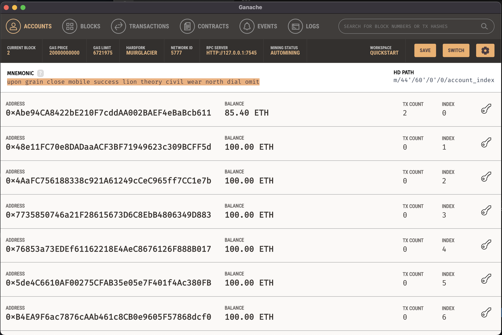
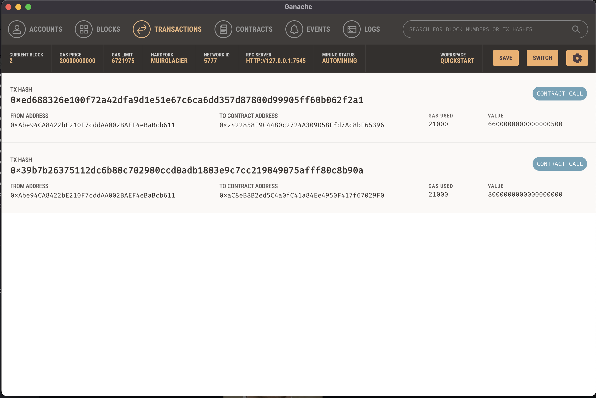
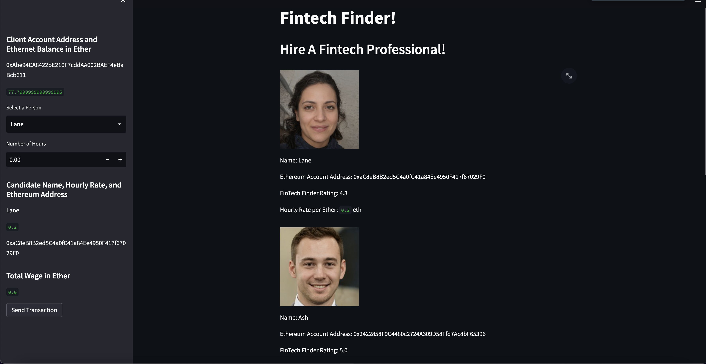
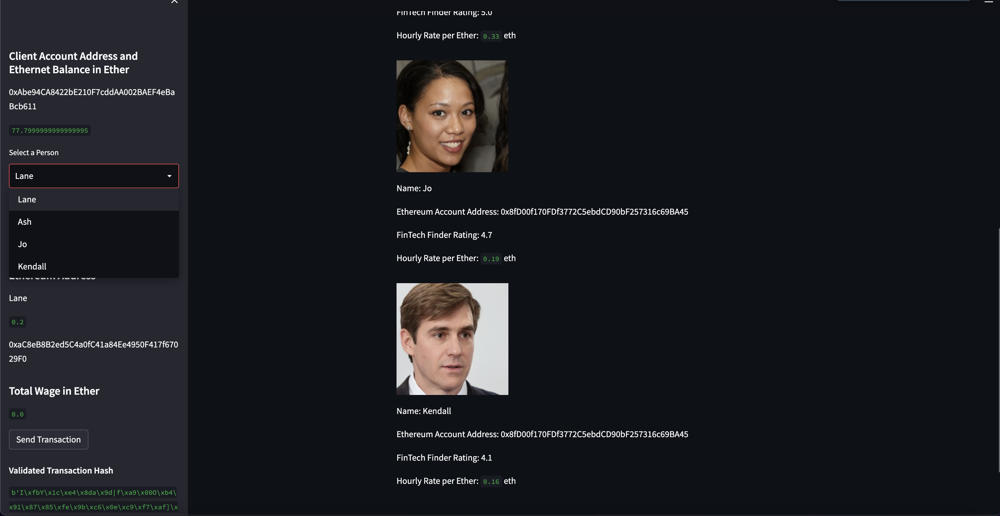

# fintech_finder

An image depicting the wallet contents after a candidate has been selected and paid for their time.

An image of the transaction confirmation.

A blockchain with the capability of finding a FinTech professional and hiring them for an amount of hours that the user chooses.

Each professional is listed with their name, address, rating, and hourly rate.  There is a sidebar with additional information, as well as the ability to select the professional and choose the number of hours you'd like to pay them for.  You can send the transaction and see the validated transaction hash.

Ganache is used to simulate wallets.

This picture displays the main screen, with the candidates for the finder.  It shows the selections for the user.  The user can choose their individual and the number of hours they wish to hire them for.  Below each individual is a list of their statistics.

This image depicts the list of candidates, as well as shows the validated transaction hash.  The user has a number of selections to choose from, as well as a display of how much they will be paying for each candidate based on the number of hours chosen.

### Required Libraries:

Streamlit

Dataclasses

typing

web3

os

bip44

dotenv